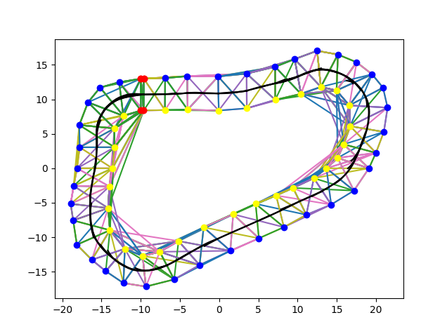
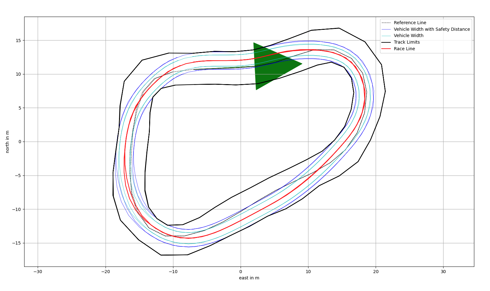
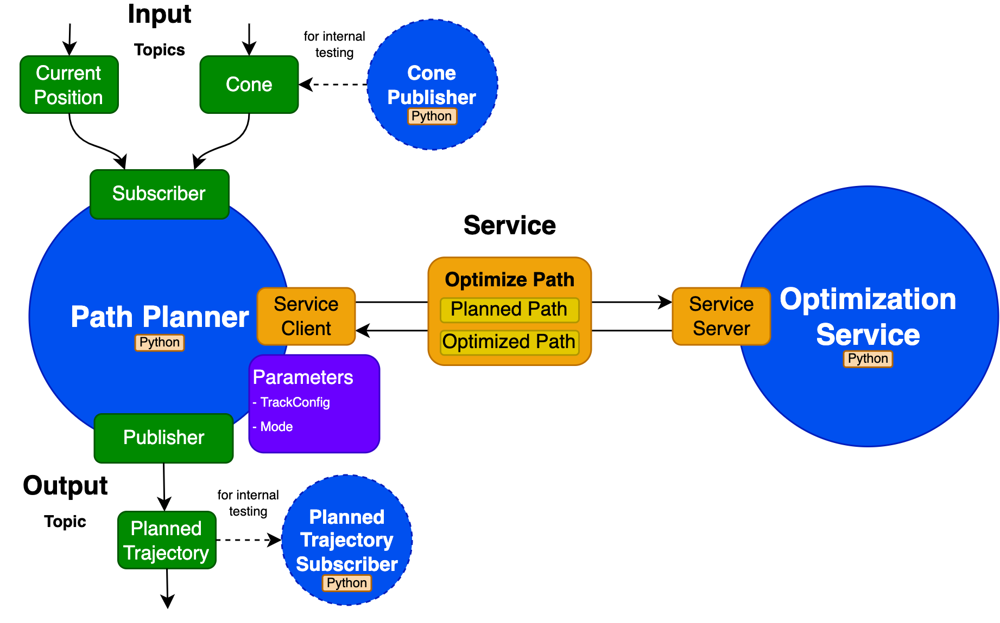
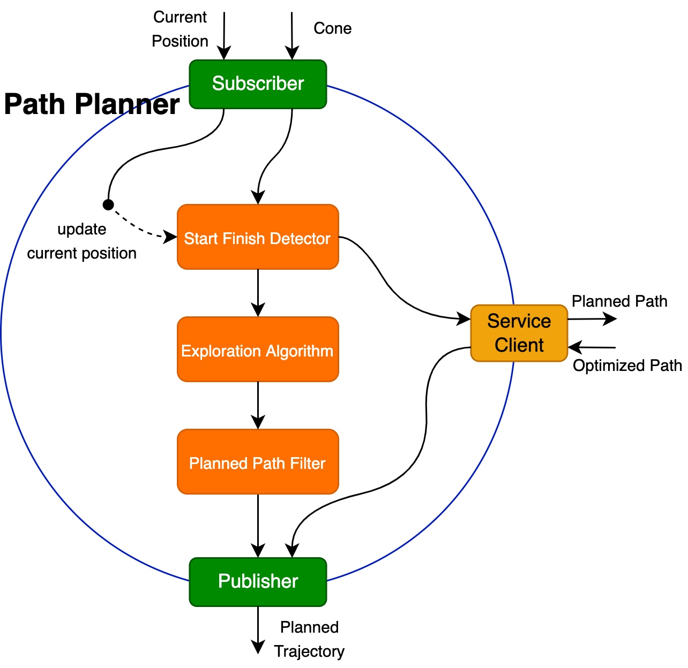
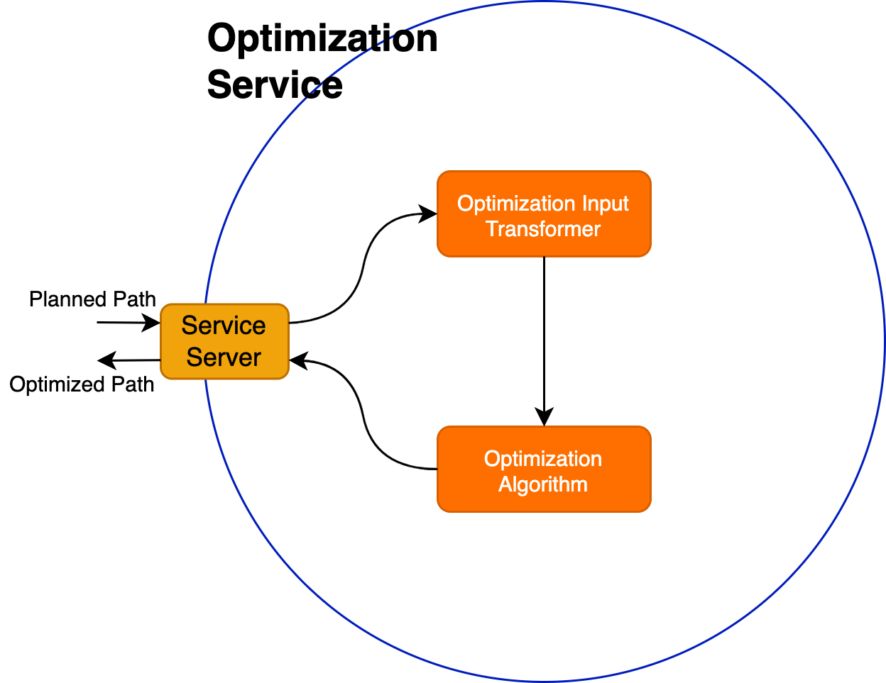
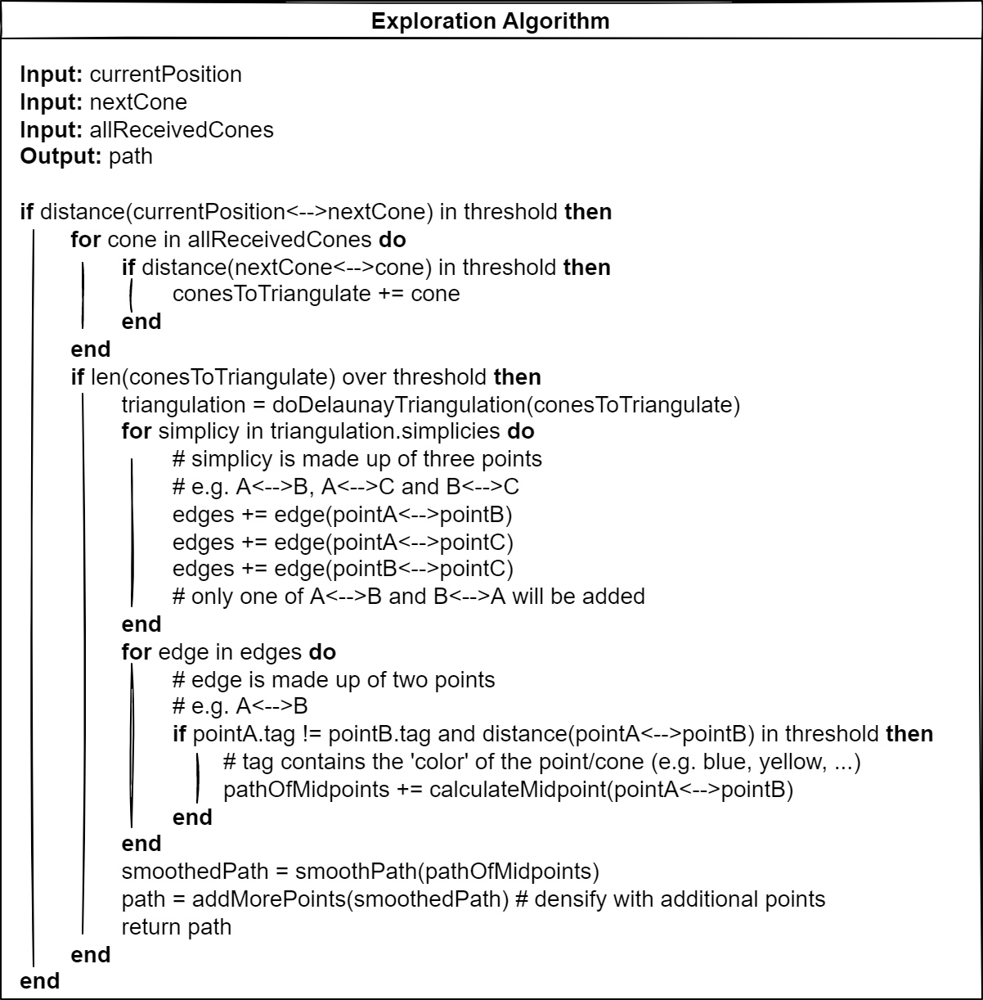
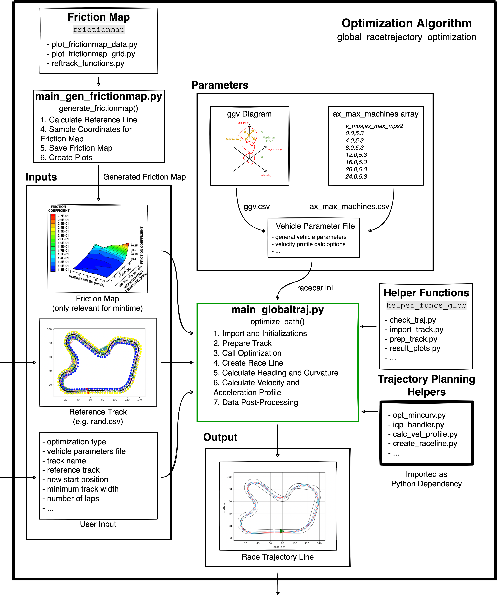

# Path Planning

<!-- PROJECT LOGO -->
<br />

<p align="center">
  <a href="https://github.zhaw.ch/FSZHAW/ROS_Path_Planning">
    
  </a>


  <h3 align="center">Path Planning</h3>

  <p align="center">
		Path Planning package for the Autonomous System of Zurich UAS Racing.
    <br />
    <a href="https://github.zhaw.ch/FSZHAW/BA_Path_Planning"><strong>Explore the thesis »</strong></a>
    <br />
    <br />
    <a href="https://github.zhaw.ch/FSZHAW/ROS_Path_Planning">View Presentation</a>
  </p>
</p>

<!-- TABLE OF CONTENTS -->
<details open="open">
  <summary><h2 style="display: inline-block">Table of Contents</h2></summary>
  <ol>
    <li><a href="#about-the-project">About The Project</a></li>
    <li><a href="#thesis">Thesis</a></li>
    <li><a href="#workspace">Workspace</a></li>
    <li><a href="#parameters">Parameters</a></li>
    <li><a href="#architecture">Architecture</a></li>
    <li><a href="#algorithms">Algorithms</a></li>
    <li><a href="#contact">Contact</a></li>
  </ol>
</details>

## About the Project
The implemented path planning algorithms manoeuvre the vehicle inside the track marked by cones. Sensors detect the cones (Perception) and the car's position (Localisation).

The first algorithm, the so-called “Exploration Algorithm”, calculates the middle line of the track. The output of the exploration algorithm will be delivered to the second algorithm, the so-called “Optimization Algorithm”, which optimizes the middle line with the information of the car’s attributes to an optimal racing line.

## Thesis

The corresponding thesis can be found under:

https://github.zhaw.ch/FSZHAW/BA_Path_Planning

 

## Workspace

Workspace structure

```bash
ROS_Path_Planning/ # Workspace Root
	build/
	install/
	log/
	launch/ # ROS Launch Files
		path_planning_launch.py
	src/ # All packages in src
		fszhaw_msgs/ #ROS Custom Messages (Whole ZUR Autonomous System)
		interfaces/ # ROS Custom Messages (Path Planning internally)
		path_planning/ # Path Planner
			path_planning/ # Code of package
				algorithm/ # Algorithms specific Code
					__init__.py
					exploration/ # Exploration Algorithm
					optimization/ # Optimization Algorithm
				mock/ # Mock Nodes
					__init__.py
					cone_publisher.py
					planned_trajectory_subscriber.py
				model/ # Models
					__init__.py
					coordinate.py
					mode.py
					racetrajectory.py
					refpoint.py
					setup.py
					tag.py
				util/ # Utility Classes
					__init__.py
					path_planning_helpers.py
					track_plotter.py
				__init__.py
				path_planner.py # Path Planner ROS Node
				start_finish_detector.py
				planned_path_filter.py
				optimization_service.py # Optimization Service ROS Node
				optimization_input_transformer.py
				track_config.py # Track Configurations
			resource/ # maps, parameters, ...
			test/
			package.xml # file containing meta information about the package
			setup.cfg # required when a package has executables, so `ros2 run` can find them
			setup.py # containing instructions for how to install the package
```

## Getting Started

1. (Optional) Edit config files

   `package.xml`: name, version, description, maintainer + email, license, dependencies

   `setup.py`: name, version, maintainer, email, description, license, entry points

   `setup.cfg`: should already be ok

2. Initialize submodules (fszhaw_msgs)

   `git submodule update --init`

3. Install dependencies (from workspace root `ROS_Path_Planning`)

   `rosdep install -i --from-path src --rosdistro foxy -y`

4. Build packages (from workspace root `ROS_Path_Planning`)

   Optional: If colcon command is still missing

   `sudo apt install python3-colcon-common-extensions`

   `colcon build`

   or

   `colcon build --packages-select <package_name>`

5. Source ROS distribution

   `source /setup/ros/foxy/setup.bash`

6. Source setup files

   `. install/setup.bash`

7. Run package

   `ros2 launch launch/path_planning_launch.py`

   or with parameters:

   `ros2 launch launch/path_planning_launch.py <parameter_name>:=<parameter_value>`

   Parameters:

   track_name, laps, timer_period, optimization_type, minimum_track_width, show_calc_times, show_plot_exploration, show_plot_optimization, mock_current_position

## Parameters

| Parameter Name           | Default Value: Type | Values                                                       | Description                                                  |
| ------------------------ | ------------------- | ------------------------------------------------------------ | ------------------------------------------------------------ |
| `track_name`             | "sim_tool": string  | "acceleration.csv", "skidpad.csv", "small_track.csv", "rand.csv", "comp_2021.csv", "garden_light.csv" | Name of the track (file).                                    |
| `laps`                   | 2: int              | Any positive Integer greater than zero (1-Infinity).         | Laps to be driven/published.                                 |
| `timer_period`           | 0.2: float          | Any positive Float greater than zero.                        | Cone to be published in seconds.                             |
| `optimization_type`      | "mincurv": string   | "shortest_path", "mincurv", "mincurv_iqp", "mintime"         | Objective to be used by the Optimization Algorithm.          |
| `minimum_track_width`    | None: float         | Any positive Float greater than zero.                        | Minimum Track Width to be used for the Optimization Algorithm. |
| `show_calc_times`        | False: bool         | True, False                                                  | If Calculation Times of the Exploration Algorithm should be displayed. |
| `show_plot_exploration`  | False: bool         | True, False                                                  | If figures for the Exploration Algorithm should be plotted.  |
| `show_plot_optimization` | False: bool         | True, False                                                  | If figures for the Optimization Algorithm should be plotted. |
| `mock_current_position`  | True: bool          | True, False                                                  | If the current position of the vehicle should be mocked with the last published path points. |

## Architecture



### Path Planner Node



### Optimization Service Node



## Algorithms

### Exploration Algorithm



### Optimization Algorithm



## Contact

- Marco Forster - forstma1@students.zhaw.ch
- Dan Hochstrasser - hochsdan@students.zhaw.ch

